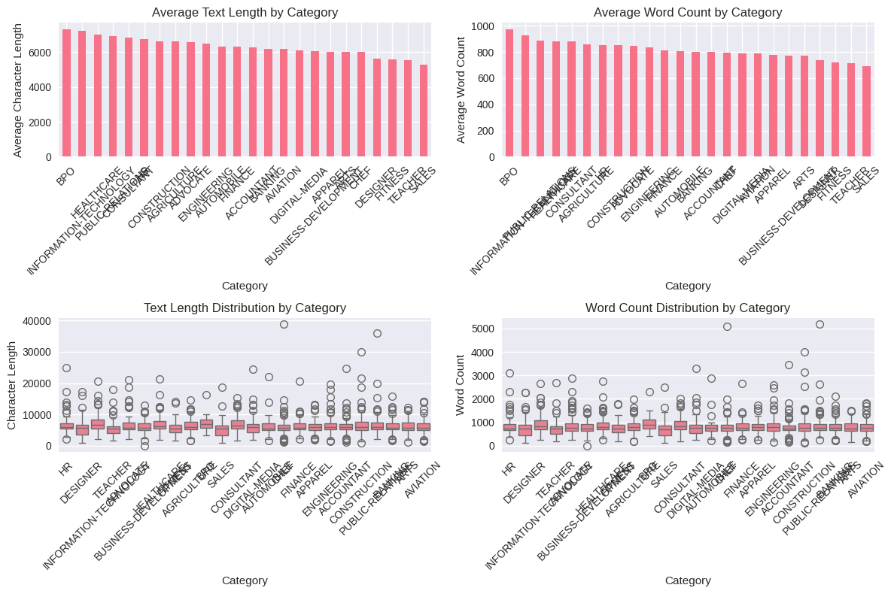
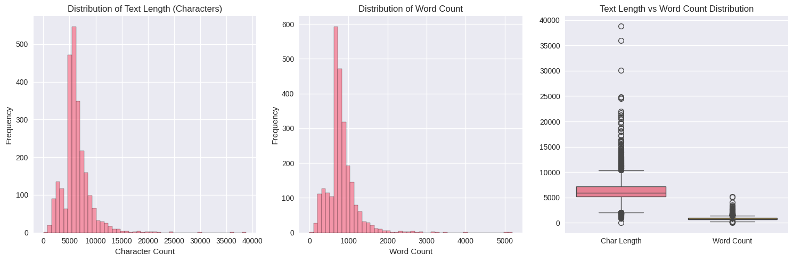
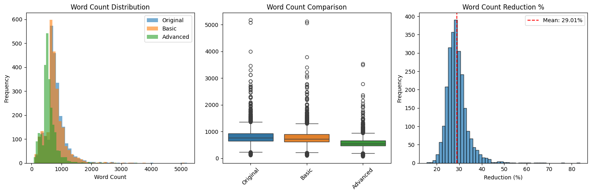
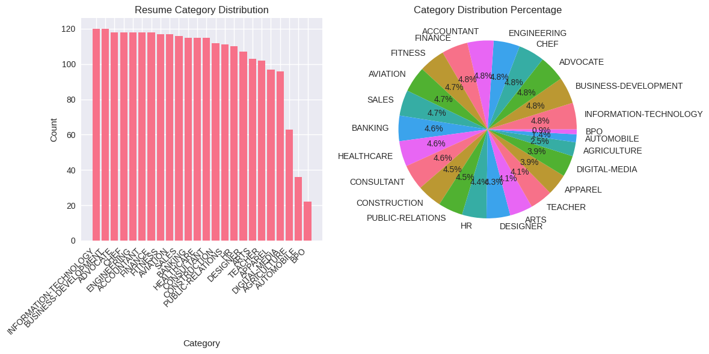
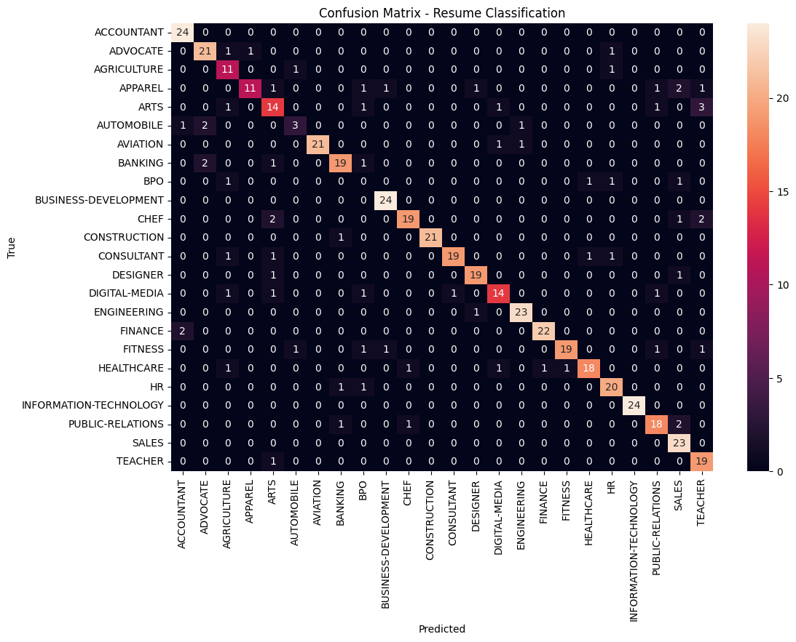

# ML_Veridia
# 📄 Resume Classification using DistilBERT

### Internship @ **Veridia.io**

---

## 🎯 Objective
Fine-tune a model that classifies resumes into different categories, similar to an ATS (Applicant Tracking System).

---

## 💡 Project Overview
This project involves fine-tuning a **DistilBERT-based resume classifier** to automate job category prediction from raw resume text.  
The model is designed for **real-time classification** and **deployed on AWS** for scalable inference.

---

## 🧭 Approach Followed

### 1. 🧩 Exploratory Data Analysis (EDA)
Performed detailed EDA to understand the dataset’s structure and balance:
- Checked dataset shape, missing values, and category imbalance.
- Analyzed average word/token counts per resume to set `max_length = 512`.
- Visualized TF-IDF and frequency patterns to identify distinct category clusters.

  

---

### 2. 🧹 Data Preprocessing
Refined the resume text data to improve input quality:
- Lowercased all text and removed special characters, URLs, digits, and extra whitespace.
- Eliminated stopwords while retaining key domain-related terms.
- Applied **advanced lemmatization** using `WordNetLemmatizer` to normalize word forms.

  
  

---

### 3. 🔠 Tokenization
Converted the cleaned text into numerical tokens using the **DistilBERT tokenizer**:
- Applied **padding** and **truncation** (max length = 512) for consistent input size.
- Verified input sequences before training.

  

---

### 4. 🏋️ Model Training
- Implemented a **Weighted Trainer** to handle class imbalance.
- Fine-tuned the model for **9 epochs** with a learning rate of `3e-5` using **AdamW** optimizer.
- Monitored training metrics: **loss**, **accuracy**, **F1-score**, **precision**, and **recall**.

---

### 5. 📊 Evaluation
- Achieved **F1-score > 0.85** with strong validation accuracy and minimal overfitting.
- Analyzed confusion matrix and class-wise metrics.
- Applied **softmax temperature scaling (T = 0.2)** to enhance prediction confidence.

  

---

### 6. 💾 Model Saving
Exported components for reproducibility:
- Fine-tuned **DistilBERT model**
- **Tokenizer**
- **Label Encoder (`label_encoder.pkl`)**

---

### 7. ☁️ Deployment
- Integrated into a **Streamlit web interface** for resume classification.    
- Designed to integrate seamlessly with ATS or HR applications.

---

## 🧰 Tech Stack / Frameworks Used

| Category | Tools & Libraries |
|-----------|-------------------|
| **Programming** | Python |
| **Deep Learning & NLP** | PyTorch, Transformers (Hugging Face), DistilBERT, BERT |
| **Text Processing** | NLTK (lemmatization, tokenization), Stopword Removal, Advanced Cleaning |
| **Data Handling & Analysis** | Pandas, NumPy, Matplotlib, Seaborn |
| **Machine Learning Utilities** | Scikit-learn (LabelEncoder, Metrics) |
| **Deployment & Web App** | Streamlit|
| **Version Control & Environment** | Git, Jupyter Notebook |

---

## 🚀 Outcome
Successfully fine-tuned and deployed a **DistilBERT-based resume classifier** achieving high performance and scalability.  
Capable of automatically categorizing resumes across multiple job domains with real-time prediction capability.

---

## 👨‍💻 Author
**Nannuri Sai Kamal**  
*Intern – Veridia.io*  
B.Tech Mechatronics | IIT Bhilai

